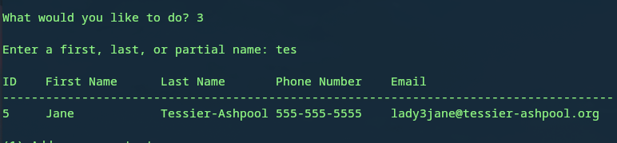

# Contact Lyst
## A simple contact book written in Python using sqlite
With Contact Lyst you can add a contact's name, phone number, and email, 
update a contact's information, remove a contact, and search for a contact
by name.
### Requirements
Python 3.6+
### Instructions
1. Clone the repository or download the zip (and extract it)
2. Navigate into the Conatct Lyst folder
### Usage
In the directory where the program is located simply run `python3 main.py`
You will be greeted by a simple menu with your options. Select the number of
the option you want and press Enter   
   
### Adding contacts   
When adding contacts you must enter a first name, a last name, and a phone number. 
An email is optional. The phone number and email (if entered) must be unique to each
contact.     
   
### Viewing your contact book   
After a few additions, your contact book may look something like this:
   
### Updating a contact   
When updating a contact you will need to enter the contact's id number. You will 
then be given various prompts on which pieces of information you'd like to update. 
Again, when updating a contact's phone number and email must be unique.   
   
The changes will be updated in the database  

### Searching for a contact by name   
You have the option to search for a contact by name. The search parameter can be
a first name, last name, or a partial name.   
   
### Deleting a contact   
Like updating a contact, to delete a contact you will need to enter the contact's id.
That is all that's required to delete a contact.  

